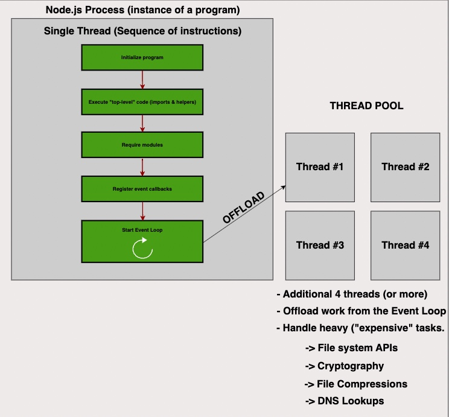

## With draw.io 
## We can plan & design our Full Stack apps with crystal clear :D

<h2>Draw.io is a workflow diagram web-based software to allow us perform some Data-modeling in app dev</h2>

<h2>Draw.io offers a variety of Icons for us to demonstrate ideas solidly :D</h2>
<h2>Available icons ranging from Frontend, Backend, AWS/Azure Cloud, Docker, Kubernetes</h2>

<h2>For example, we're designing a Frontend React => Express REST API</h2>
<h2>We can draw out all necessary params & Data-flow</h2>

<h2>For example, we'd like to illustrate Node.js Event Loop sequencing before performing a Node.js fork() subprocess to utilize more CPU on our host machine</h2>

<h2>Sometimes, we'd like to discuss complex ideas with our fellas</h2>
<h2>For example, Aassociations Modeling in a MVC application</h2>

